# Handoff: CuraLink (consumer) + CuraLink Plus (staff/provider)

## Overview
Two companion mobile apps for a home-healthcare product in Hyderabad, India, sharing one backend:

- **CuraLink** — patient/family-facing app. Book nurses, doctors, physio, vets, lab tests, ambulances to come home; track visits live; manage family, prescriptions, wallet, insurance, and more.
- **CuraLink Plus** — staff/provider app for the people who deliver that care: nurses, doctors, vets, pharmacy partners, ambulance partners, and partner admins who manage them.

A booking made in CuraLink is the exact job a nurse accepts in CuraLink Plus. A nurse's live GPS published from Plus is the exact feed the family's tracking map in CuraLink consumes. Build both apps against **one shared schema** (see "Shared backend" below) — do not treat them as independent products.

## About the design files
Everything in `prototypes/` is an **HTML/JS design reference** (Design Components — inline-styled, self-contained prototypes built with a proprietary templating runtime), not production code. They demonstrate intended look, content, and behavior screen-by-screen. Your task is to **recreate these designs in the target codebase's environment** (React Native/Expo + TypeScript is recommended for both apps, given they're mobile-first with a shared component/design language — but defer to whatever stack your codebase already uses, or choose the best fit if starting fresh). Do not port the prototype's HTML/templating syntax directly — treat it as a functional + visual spec.

## Fidelity
**High-fidelity.** Colors, type, spacing, copy, and component states in the prototypes are final-intent, not placeholder. Recreate pixel-accurately using your codebase's component library and design-token conventions, then wire to real data/APIs per the contracts below.

## Files in this package
```
design_handoff_curalink/
├── README.md                                   ← this file, start here
├── prototypes/
│   ├── CuraLink.dc.html                        ← consumer app, full prototype (62 screens)
│   ├── CuraLink Plus.dc.html                   ← staff/provider app, full prototype (6 roles)
│   └── CuraLink Coral v1 (alt, non-canonical).dc.html  ← early alt palette, NOT the current direction — reference only if curious, do not build from it
├── support/                                    ← small runtime files the prototypes import (map embed, iOS bezel, doc shell, templating runtime). Reference only — your production app will use real equivalents (a real Maps SDK, native device chrome, etc), not these.
│   ├── leaflet-map.jsx                         ← Leaflet/OSM map component used by every map screen in both prototypes
│   ├── ios-frame.jsx
│   ├── doc-page.js
│   └── support.js
└── reference-docs/                             ← prose write-ups with embedded screenshots, produced during design. Screenshots are bundled alongside (below) so images render when opened from this zip.
    ├── CuraLink Plus - Developer Handoff.dc.html
    ├── CuraLink - Developer Handoff.dc.html
    ├── CuraLink-original-design-spec.md        ← original product/design brief for the consumer app (personas, full design system rationale, screen-by-screen spec) — the richest single reference for CuraLink
    ├── uploads/CuraLink home healthcare app/screenshots/   ← 35 full-screen captures of the CuraLink consumer app, referenced by CuraLink - Developer Handoff.dc.html
    └── screenshots/handoff2/                   ← 16 full-screen captures of CuraLink Plus (maps, multi-role, payouts, per-role homes), referenced by CuraLink Plus - Developer Handoff.dc.html
```
Open any `.dc.html` or `.html` file directly in a browser to view it.

---

## Screens / views

### CuraLink Plus — 6 roles, ~70 screens
All roles share onboarding: Splash → Welcome/role picker → Login → Signup → Phone+OTP → Professional details (2 steps, role-aware labels) → Bank details → Verification pending → Approved → Availability setup → role Home.

- **Nurse / Vet**: Home (on-duty/off-duty/active-visit states) → Jobs list → Job detail (map) → Accepted → En route (live map) → Arrived → Visit in progress (Vitals/Notes/Medications/Labs/Photos tabs) → Complete-visit checklist → Visit completed (rating + handoff note to care team) → Schedule/availability/time-off → Earnings (+ detail, withdraw, payout methods, payout history, tax docs, tips) → Profile (+ documents, reviews, preferences, training) → Team chat → Add another role.
- **Doctor**: Home (teleconsult queue) → Incoming teleconsult → Video consult → Prescription writer → Prescription review/sign → Post-consult notes → Prescriptions history.
- **Pharmacy Partner**: Home (accepting toggle, stats, incoming orders) → Orders (Active/History) → Order detail (per-item stock check + substitute field) → Fulfillment stepper (Preparing → Ready → Picked up → Completed, rider pickup code) → Pickup map → Inventory/low-stock alerts → Reviews.
- **Ambulance Partner**: Home (on-duty toggle, emergency requests) → Requests (Active/History) → Request detail → Transport flow (En route → Arrived → Transporting → Completed, live map, publishes GPS) → Live map → Trip history → Vehicle & crew → Reviews.
- **Partner Admin**: Dashboard (metrics + Pharmacy network / Ambulance fleet cards) → Live dispatch map (nurse jobs = green, pharmacy = blue, ambulance = red) → Team roster → Team member detail → Add team member → Reassign job → Billing → Payouts → Compliance → Analytics → Reports export → Pharmacy network → Ambulance fleet.
- **Shared utility (all roles)**: Notifications (+ detail), Help center, Ops support chat, Cura Assistant (AI), Settings (incl. dark mode, language), Emergency/SOS, Partner-pharmacy locator, Design system reference.
- **Multi-role accounts**: a single verified identity can hold >1 role. Profile → "Your roles" lists active roles with a "+ Add role" flow (instant activation, same bank/docs, no re-onboarding). A role pill on Home opens an in-place switcher that swaps the whole dashboard without a logout/login round-trip.

### CuraLink (consumer) — 62 screens
- **Onboarding/auth**: Splash → Welcome carousel → Login → Signup → Phone OTP → Care setup ("who are you caring for?").
- **Home & booking**: Home dashboard (rapid-care hero, active-visit card, service tiles, "Book again", health grid) → All services → Category detail → 5-step booking (Service → Who for → Date/time → Address → Summary & Pay, incl. a payment-failed error state) → Booking success.
- **Live visit (hero surface)**: Active visit tracking (live map, animated vehicle, nurse card, arrival OTP, status timeline) → Visit in progress → Visit completion (rate/tip/review).
- **Profile & family**: Profile home (family/pets, Care Plus upsell) → Add/edit family member → Medical records → Emergency contacts.
- **History & prescriptions**: Bookings (Upcoming/Past) → Past booking detail → Prescriptions library → Prescription detail ("Order these medicines" → Pharmacy).
- **Wallet & payments**: Wallet home → Add money → Payment methods → Transaction detail.
- **Support & settings**: Help center (FAQ) → Chat support → Settings (notifications, language, dark mode, biometric) → Notification center → Design system reference.
- **Extended surfaces (40+)**: Vitals dashboard, recovery/care plan timeline, insurance & claims, lab reports + book-a-test, pharmacy orders, subscription plans (Care/Care Plus/Family Plus), reviews, ambulance booking (BLS/ALS), provider profile, appointment reminders, diet plan, refer-a-friend, home ICU setup, medical team + second opinion, chronic care programs, checkup packages, home nursing subscription, donate/blood requests, video consultation, loyalty rewards, health articles, appointment calendar.

For exact layout, copy, and component detail per screen, open the prototypes directly — every screen is a `<section>`/state in the two `.dc.html` files, in the order listed above. `reference-docs/CuraLink-original-design-spec.md` has the fullest prose spec for the consumer app's screens.

## Design tokens

### CuraLink Plus — "Clinical Confidence"
| Token | Hex | Use |
|---|---|---|
| Primary teal | `#0F7A5E` | CTAs, nurse/vet role color |
| Amber accent | `#F4A23B` | Ratings/tips |
| Doctor blue | `#3B82F6` | Doctor role color |
| Vet purple | `#8B5CF6` | Vet role color |
| Admin slate | `#64748B` | Admin role color |
| Pharmacy sky | `#0EA5E9` | Pharmacy role color |
| Ambulance red | `#DC3545` | Ambulance role color, emergency accents |
| Light: ink/surface/bg | `#10192B` / `#FFFFFF` / `#F7F8FA` | |
| Dark: ink/surface/bg | `#F5F3EF` / `#131E33` / `#0A1628` | |

Type: Plus Jakarta Sans (headings, 600–800) + Inter (body, 400–700). Radius 10–16px. Shadows minimal — hairline borders carry most elevation.

### CuraLink — "Caring Warmth"
| Token | Hex | Use |
|---|---|---|
| Primary green | `#00C27C` | CTAs, active states |
| Primary-strong | `#00CE86` | Gradients, splash |
| Primary-press | `#057A4E` | Pressed state, "from ₹" prices |
| Navy | `#0B1D2E` | Trust sections, dark cards |
| bg / surface | `#FAFAF8` / `#FFFFFF` | App bg / cards |
| ink / muted / faint | `#0A1B2A` / `#51677C` / `#98A6B4` | Text hierarchy |
| border / border-2 | `#E3E7EA` / `#E8ECEF` | 1px borders |
| success/warning/error/info | `#0E9F6E` / `#B45309` / `#C81E1E` / `#1D6FB8` | Semantic (each has a tint bg — see spec) |
| star | `#E8A33D` | Ratings |

Category accents: nurse `#057A4E`, doctor `#142A3E`, physio `#B45309`, vet `#B87333`, pediatric `#6D5FA3`, lab `#0B1D2E`. Dark mode defined (warm-charcoal navy base). Type: Bricolage Grotesque (headings, 400–800) + Inter (body, 400–700). Radius: cards 16–20px, buttons 12–14px, pills 99px, sheets 28px (top). Icons: Feather/Lucide line set, stroke-width 1.8–2.4, no filled icons anywhere in either app.

Both apps: 8pt spacing scale, minimum text size ~10.5px (captions only), minimum tap target 44px.

## Interactions & behavior
- **Navigation**: stack-based push/pop; root tabs (5-tab bottom nav in both apps) clear the stack.
- **CuraLink instant/express booking** (core USP): preselects nearest provider + earliest slot, skips straight to payment — wire to a real "find nearest available provider" query.
- **Payment**: prototype's first attempt intentionally fails to demonstrate the error sheet; retry succeeds. Real integration: Razorpay order + webhook.
- **Live visit tracking**: ETA countdown → "Arrived" toast. In production this is a live subscription to the same GPS stream CuraLink Plus's En-route/Transport screens publish.
- **Cura AI assistant** (CuraLink) / **Cura Assistant** (Plus): persistent floating entry point, LLM-backed concierge/copilot. In production, scope to an authenticated-user tool-calling agent proxied through your backend (never call the LLM directly from the client with a bare API key).
- **Multi-role switching** (Plus): must swap dashboard/permissions instantly, no fresh auth round-trip.
- **Maps**: both apps' 8+ map screens use Leaflet/OSM (`support/leaflet-map.jsx`) with real Hyderabad coordinates — swap for a production Maps SDK (Google Maps or Apple Maps) behind the same marker/route/live-location data shape.

## State management (production shape)
Split into: **Auth/session** (phone/email, OTP, JWT, current user + active role); **server state** via React Query/RTK Query (profile, family, addresses, providers, bookings with live status, prescriptions, labs, vitals, insurance, wallet, orders, subscriptions, reviews, notifications, chat); **ephemeral UI state** (booking-flow selections, cart, toggles, in-progress form fields); **realtime subscriptions** (visit status + provider GPS, chat messages, notifications).

## Shared backend — core entities
One backend, one database, for both apps.

| Entity | Key fields | Written by | Read by |
|---|---|---|---|
| User / Professional | id, role(s) — array, for multi-role — credentials, docs[], bankDetails, payoutMethods[], availability, rating | Plus onboarding / add-role | Consumer booking cards |
| Booking / Visit | id, patient, service, status (pending→confirmed→en_route→in_progress→completed\|cancelled), vitals, notes, medsGiven[], labReports[], handoffNote, payout | Both (consumer creates/cancels/rates; Plus accepts/advances/completes) | Both |
| Provider location (GPS) | jobId/requestId, lat/lng, ts | Plus (continuous publish during en-route/transport) | Consumer live-tracking map |
| Prescription | id, patientId, meds[], advice, doctorSignature | Plus (doctor) | Consumer Health Records; source for pharmacy orders |
| Lab order / report | id, tests[], status, fileUrl | Consumer (books), lab uploads | Consumer downloads |
| Pharmacy order | id, items[{name,qty,inStock,substitute}], status, pickupCode | Consumer or nurse creates; pharmacy partner fulfills | Consumer order tracking |
| Ambulance request | id, patientInit, type (BLS/ALS), reason, pickupAddr, hospital, status | Consumer or Plus (SOS) creates; ambulance partner accepts | Consumer emergency tracking |
| Wallet / transaction | balance, method (Razorpay), history | Consumer | Consumer |
| Team roster | id, name, role, status, rating, docsOk | Plus admin | Plus admin only |
| Chat channel / message | type (care-team/handoff/escalation/ops/patient-support), members[], messages[] | Both, contextually | Participants only |
| Payout method / record | method (bank/UPI), isDefault; date, amount, status | Plus professional links method; system generates records | Plus (professional + admin aggregate) |

**Realtime** (WebSocket / Supabase Realtime / Firebase) for: booking status + visit events, provider-location stream, chat, push notifications (FCM).

Suggested REST surface: `POST /auth/otp`, `/auth/verify`, `GET /me|family|addresses|services|providers`, `POST /bookings` (+ `express:true`), `GET /bookings/:id` + realtime channel, `POST /bookings/:id/rate`, `POST /payments/order` + webhook, `POST /pharmacy-orders`, `POST /ambulance-requests`, `POST /lab-orders`, `POST /second-opinion`, plus role-scoped Plus endpoints for accept/advance/complete on each of the above.

## Assets
- **Fonts**: Plus Jakarta Sans + Inter (Plus); Bricolage Grotesque + Inter (CuraLink). All via Google Fonts.
- **Icons**: Feather/Lucide line set throughout — map to `lucide-react-native`.
- **Maps**: prototypes use a keyless Leaflet/OSM embed (`support/leaflet-map.jsx`) centered on real Hyderabad neighborhoods (Kondapur, Jubilee Hills, Banjara Hills, HITEC City, Madhapur) — safe to reuse as seed locations. Production needs a real Maps SDK + live provider GPS.
- **Content**: all names/addresses/prices are realistic Indian seed data (₹ formatting, Indian names/neighborhoods) — reusable as seed data for local dev/staging.

## Screenshots
Full-resolution captures live alongside this README (also embedded with captions in `reference-docs/*.dc.html`). Open any PNG directly, or open the `.dc.html` for the annotated version.

### CuraLink (consumer) — `reference-docs/uploads/CuraLink home healthcare app/screenshots/`
| | | |
|---|---|---|
|  Splash |  Welcome |  Home |
|  Booking — date/time |  Booking — pay |  Live visit tracking |
|  Profile |  Prescription |  Wallet |
|  Vitals dashboard |  Cura AI assistant |  Ambulance booking |
|  Design system |  Video consult |  Pharmacy order |

Full set (35 screens) in the folder: splash, welcome, login, care setup, home, services, category, booking date/time, booking pay, booking success, live tracking, visit complete, profile, bookings, prescription, wallet, vitals, medical team, Cura AI, home ICU, plans, ambulance, reviews, design system, video consult, pharmacy order, pharmacy history, chronic care, health checkups, home nursing, donate, insurance upload, loyalty rewards, health articles, calendar.

### CuraLink Plus (staff/provider) — `reference-docs/screenshots/handoff2/`
| | | |
|---|---|---|
| 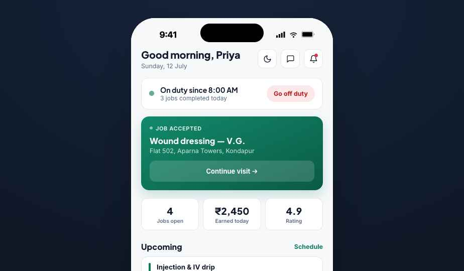 Nurse home | 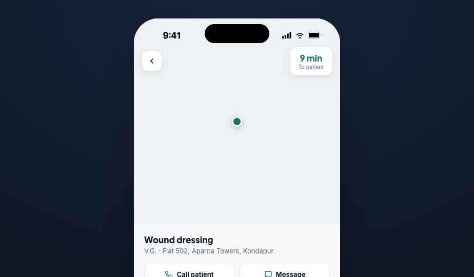 Nurse — en route (map) | 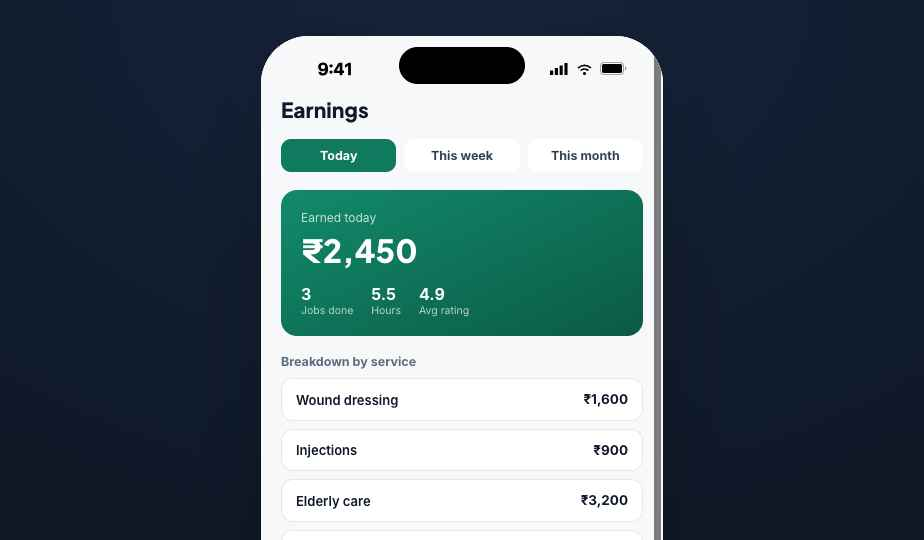 Nurse earnings |
| 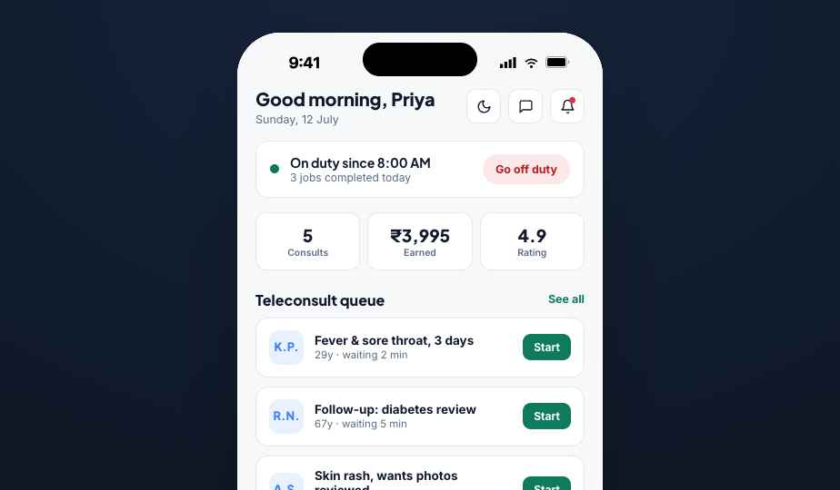 Doctor home | 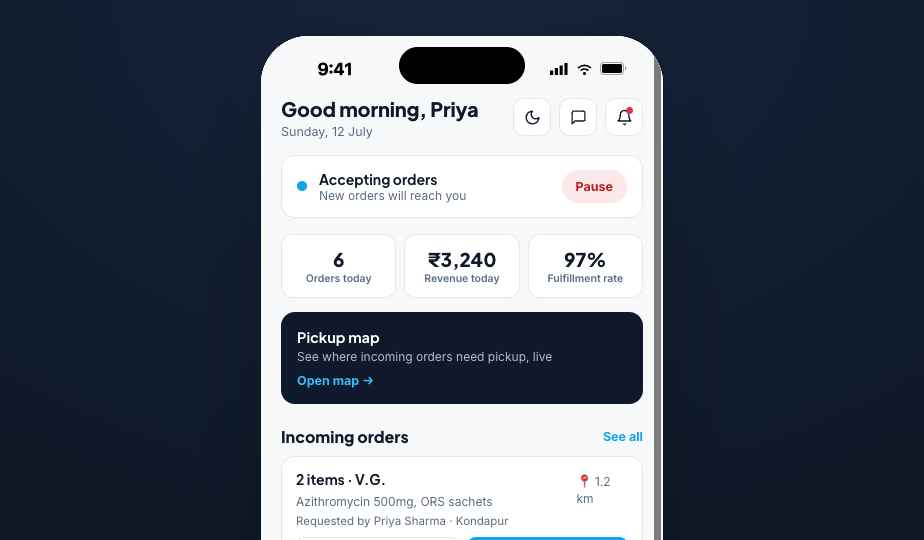 Pharmacy partner home | 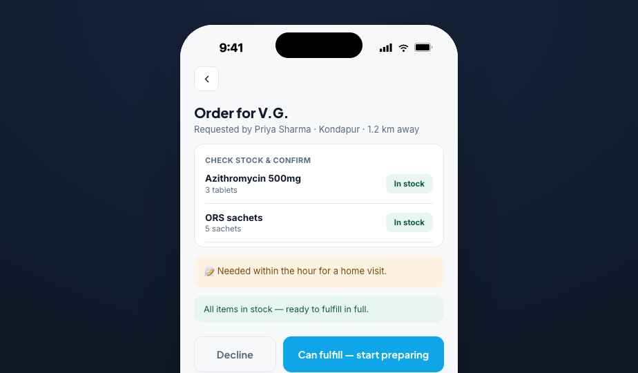 Pharmacy order detail |
| 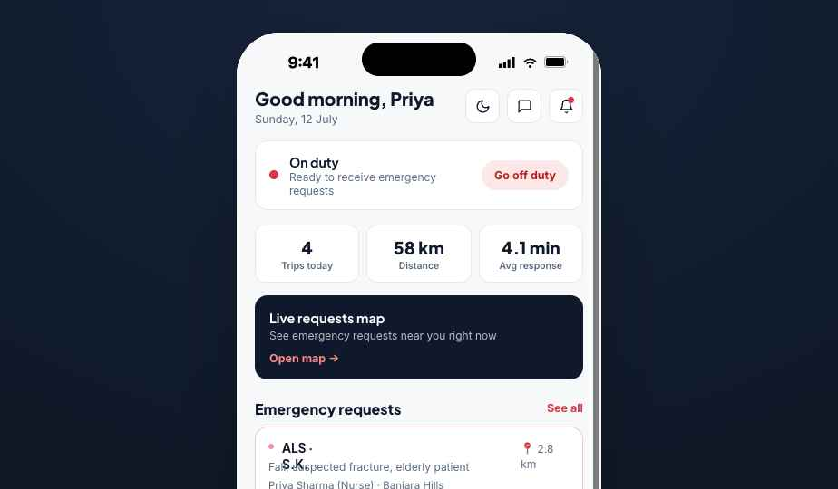 Ambulance partner home | 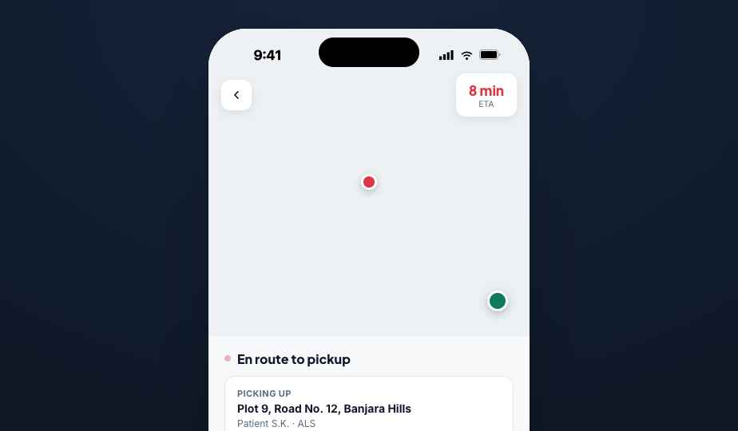 Ambulance — transport (map) | 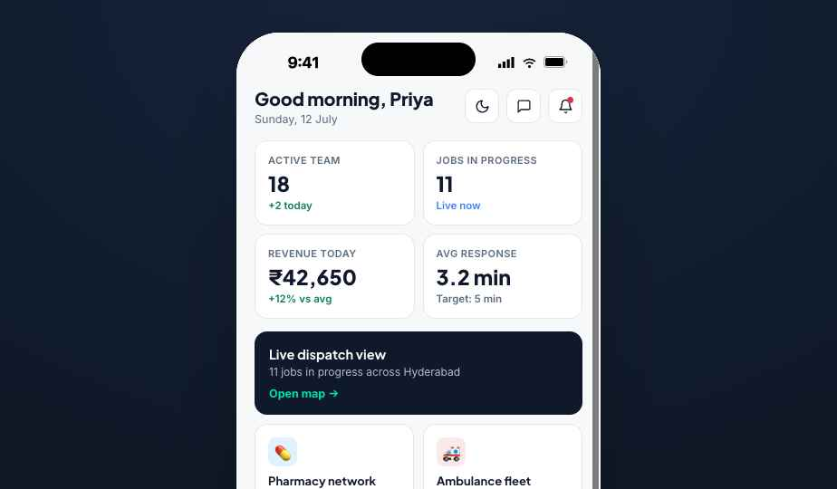 Admin dashboard |
| 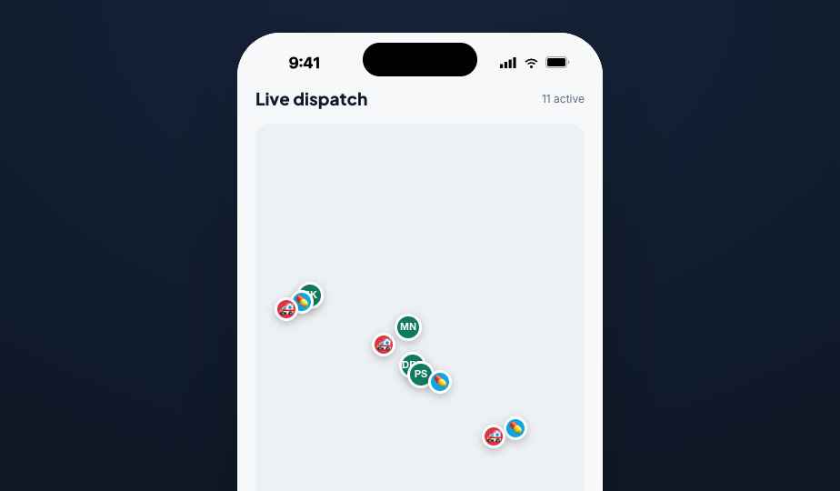 Admin — live dispatch map | 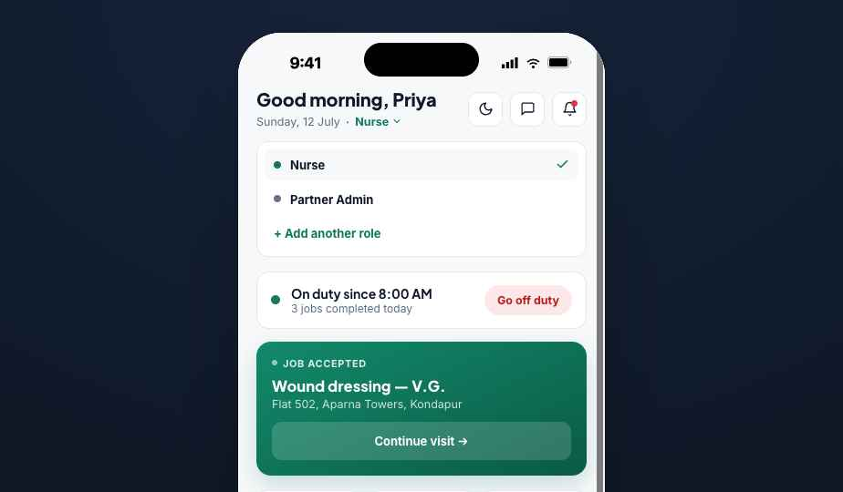 Multi-role switcher | 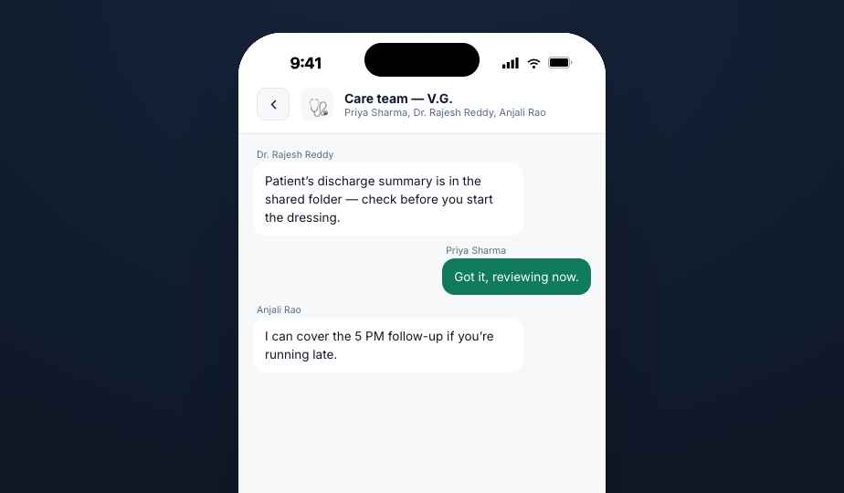 Team chat room |
| 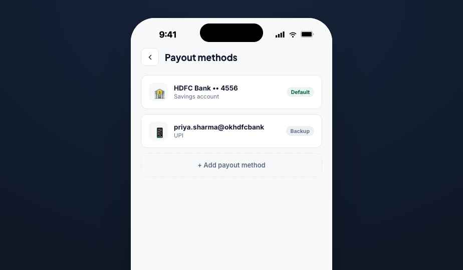 Payout methods | 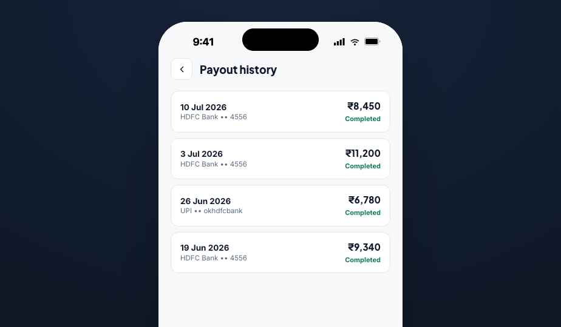 Payout history | 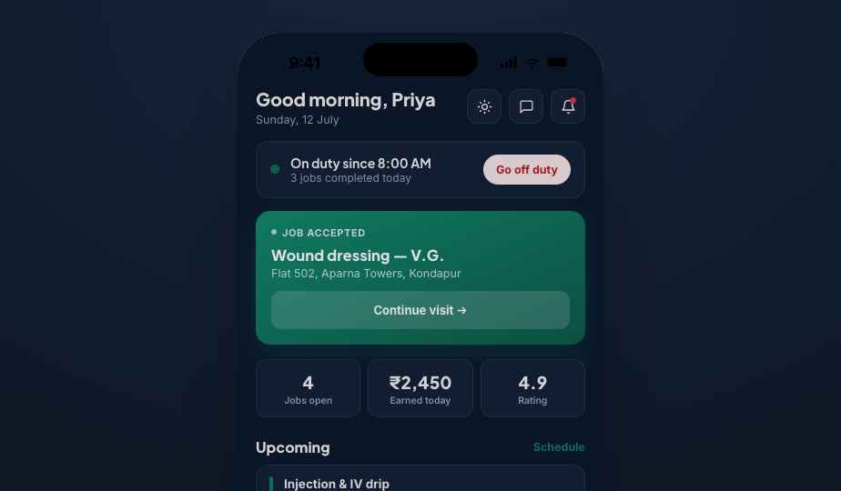 Dark mode |
| 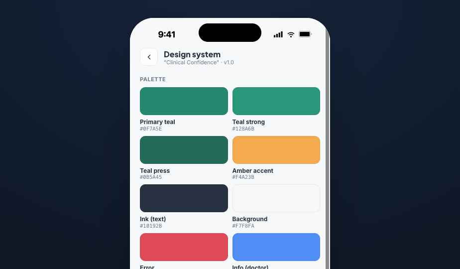 Design system | | |

## Recommended production stack (build both native apps + web from one codebase)

**Client**: React Native + Expo (managed workflow, EAS Build/Submit) for iOS + Android, and **Expo Router + React Native Web** to ship the same codebase as a responsive web app (start with the Plus admin/dispatch surfaces on web — they're desk-bound; nurse/doctor/vet/pharmacy/ambulance stay mobile-first). Share one TypeScript monorepo (Turborepo or Nx): `apps/curalink`, `apps/curalink-plus`, `packages/ui` (shared design-token components per app), `packages/api-client`.

**Backend**: Supabase (Postgres + Auth + Realtime + Storage) is the fastest credible path to everything this spec needs in one managed service:
- Postgres for the shared-entity schema (table above) — one schema, both apps.
- Supabase Auth for phone OTP (via Twilio/MSG91 provider) + JWT sessions; store `roles: text[]` on the user row for multi-role.
- Supabase Realtime (Postgres logical replication) for booking/visit status changes, provider GPS stream, and chat — no separate WebSocket server to run.
- Supabase Storage for docs/photos/prescriptions/lab reports.
- Row-Level Security policies to enforce "consumer sees own bookings", "provider sees only assigned jobs", "admin sees only their team".
If you outgrow managed Postgres/Realtime later, the schema ports cleanly to self-hosted Postgres + a Node/NestJS API + Redis pub/sub — Supabase is not a dead end.

**Integrations**: Razorpay (payments + payouts to nurses/partners via RazorpayX), Google Maps SDK (native) / Maps JavaScript API (web) for live tracking — swap in for the prototype's Leaflet embed, Twilio/MSG91 for OTP SMS, FCM for push, a proxied Claude API route (server-side) for the Cura Assistant/Cura AI so keys never ship to the client.

**Hosting**: Supabase project (managed) + Vercel for the web build and any server-side API routes (payment webhooks, LLM proxy) + EAS for app store builds.

## Suggested implementation order
1. Backend schema + auth (OTP) + seed data — build field-for-field to the shared-entity table above so both apps ship against one contract.
2. Design tokens + shared component library per app (buttons, fields, cards, status pills, bottom nav + FAB, bottom sheets, skeletons).
3. Onboarding/auth → Home shell + bottom nav, both apps.
4. CuraLink booking flow (incl. express) + Razorpay.
5. **Live visit tracking + GPS publish/subscribe** — build CuraLink's tracking screen and CuraLink Plus's En-route/Transport screens together; they're the same stream.
6. Profile/family, history, prescriptions, wallet (CuraLink) · Visit workflow, earnings, payouts (Plus).
7. Pharmacy fulfillment loop and Ambulance dispatch loop end-to-end (both apps touch these).
8. Multi-role accounts, team chat (Plus).
9. Remaining extended/long-tail surfaces in both apps.
10. Support/settings/notifications, dark mode, polish.

## Known issues / notes carried over from the design phase
- An earlier prototype build had the bottom tab bar failing to render because a visibility check referenced a route key that didn't exist in the real route table — double-check any "is this a tab-root screen" condition against your actual route list rather than a hardcoded string.
- Pharmacy pickup codes and visit/ambulance arrival codes are static demo values in the prototype — generate real OTPs server-side.
- The AI assistants call an LLM directly from the client in the prototype for demo purposes — proxy through your backend in production so you can inject real user/job context server-side and keep keys off-device.
